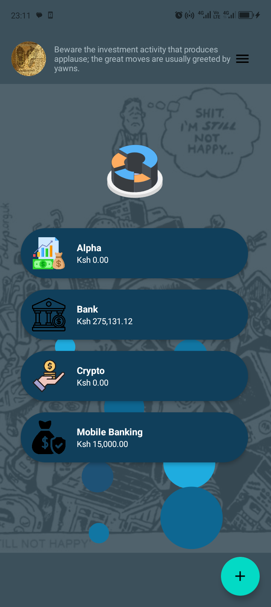
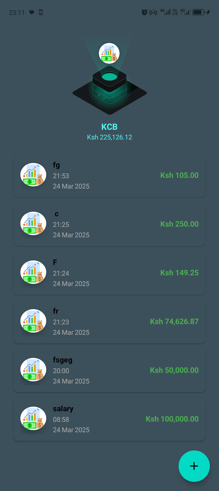
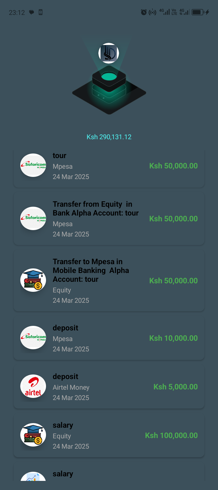

  

---

# Mesha - Personal Finance Manager
Mesha is a **personal finance management app** designed to help me take control of my money. Built from scratch because none of the existing financial apps suited my needs, Mesha offers a **simple yet powerful** way to manage my finances.

## Why Mesha?

💡 **Custom-built**  
I created Mesha because I couldn't find a financial app that worked the way I wanted.

📊 **Detailed financial analysis**  
Get **insightful reports** and visualizations of your spending patterns, income, and net worth.

🔒 **Your data, your control**  
Mesha stores all your financial data **locally on your device**, giving you complete privacy and control.

## Features

✅ **Account Management**  
- Create and manage multiple accounts  
- Track balances across different accounts  
- Detailed transaction history  

✅ **Transaction Tracking**  
- Add income and expenses with custom categories   
- Recurring transactions  

✅ **Financial Analysis**  
- Visualize your spending patterns  
- Track net worth over time  
- Generate detailed reports  

✅ **Customization**  
- Create your own transaction categories    
- Customizable account icons  

## Contributing

Mesha is an **open-source project**, and I welcome contributions from the community!

## License

Mesha is released under the [MIT License](LICENSE), which means you're free to use, modify, and distribute the code as you see fit. Just remember to include the original license!

## Screenshots

## ✨ Screenshots

  

    

      
      
<strong>Dashboard</strong>

    

    

      
      
<strong>Transactions</strong>

    

    

      
      
<strong>Analysis</strong>

    

  

## Roadmap

Here's what's coming next:
- [ ] Budgeting features
- [ ] Export reports to PDF

---
